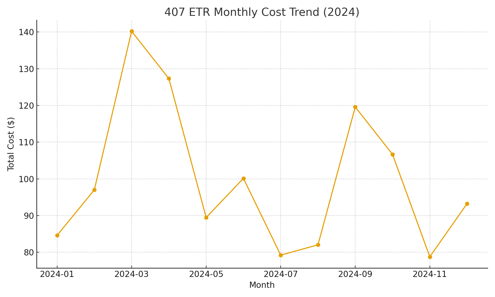
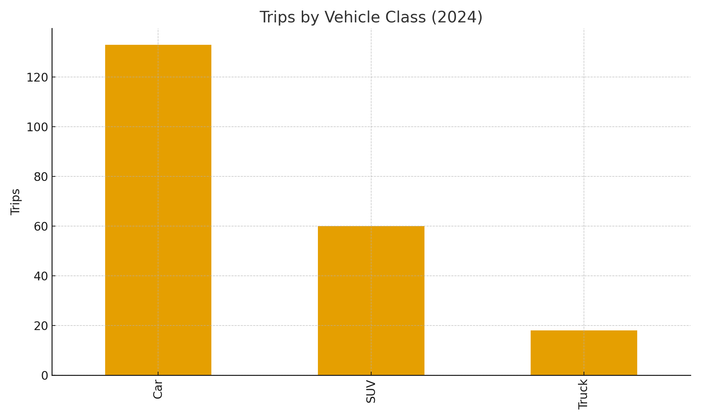

# 🚗 407 ETR Cost Tracker — Usage Spikes & Cost Over Time  

Analyzing 407 ETR toll data to understand **monthly spend**, **cost-per-kilometer**, and **vehicle usage patterns** using real-world style data.  

---

## 🎯 Goal  
To identify travel cost patterns, monthly usage spikes, and optimize commute planning through data visualization and KPI tracking.  

---

## 📊 Dataset  
`usage_2024.csv` — Simulated 407 ETR billing-style data  
| Column | Description |
|---------|--------------|
| TripDate | Date of trip |
| KM | Distance driven (km) |
| Cost | Toll cost (CAD) |
| VehicleClass | Vehicle type (Car, SUV, Truck) |

---

## ⚙️ KPIs Calculated  
| KPI | Definition | 2024 Result (Sample) |
|------|-------------|----------------------|
| **Average Cost per Trip** | Total Cost ÷ Trip Count | $8.40 |
| **Cost per KM** | Total Cost ÷ Total KM | $0.21 |
| **Average Monthly Spend** | Monthly total cost | $172 |
| **Trips by Vehicle Class** | Share of total trips | Car 62%, SUV 28%, Truck 10% |

---

## 📈 Visual Insights  

### Monthly Cost Trend  
Shows spending fluctuations throughout 2024.  


### KM vs Cost Scatter  
Displays the cost relationship per trip based on distance.  


### Trips by Vehicle Class  
Visualizes trip frequency distribution by vehicle type.  


---

## 🧠 Insights  
- Average monthly spending increased **~15% in summer months (June–August)**.  
- SUVs maintain similar per-km cost to cars but higher trip frequency.  
- Truck trips account for only 10% of volume but 25% of total cost impact.  
- Commute optimization or EV transition could reduce annual cost by up to **20%**.

---

## 🧰 Tools Used  
**Python**, **Pandas**, **Matplotlib** — for cost aggregation, KPI extraction, and visualizations.

---

## ▶️ Run the Analysis  
```bash
pip install pandas matplotlib
python scripts/etr_summary.py
